# Predict Students' Outcome

**Author:** Aziza Gulyamova
***


### Setup Instructions

!!!!!!!!!!!!!!!

### Repository Directory

```
├── README.md        <-- Main README file explaining the project's business case,
│                        methodology, and findings
│
├── data             <-- Original data and Processed(cleaned, merged) data for modeling and EDA
│
├── src             <-- Files with user defined functions and classes
│
├── notebooks        
│   ├── exploratory  <-- Unpolished exploratory data analysis (EDA) notebooks
│   └── report       <-- Polished final notebook
│
├── references       <-- Data dictionaries
│
└── figures          <-- Generated graphics and figures to be used in reporting
```

### Quick Links

1. [Data Cleaning Notebook](notebooks/exploratory/data_cleaning.ipynb)
2. [EDA Notebook](notebooks/exploratory/EDA.ipynb)
3. [Modeling Notebook](notebooks/exploratory/Modeling.ipynb)
4. [Final Recomendations Notebook](notebooks/report/Students_Performance.ipynb)
6. [Presentation Slides](notebooks/report/presentation.pdf)


## Business Problem

Academic achievement is crucial in educational environment, as it is important indicator of an educational institution’s performance. Early prediction of students’ performance can help educational institutions to navigate students to the right direction, provide the needed actions at the right moment, and to plan the appropriate training to improve students’ success rate. 

## Data 

The datasets for this project were obtained from **Open University Learning Analytics**. It contains data about **courses, students' demographics,** and their **interactions with Virtual Learning Environment** (VLE) for seven selected courses (called modules). The dataset consists of tables connected through **unique identifiers**. All tables are stored in the csv format. The tables available are following:
-	cources.csv
-	assessments.csv
-	vle.csv
-	studentsInfo.csv
-	studentsRegistration.csv
-	studentAssessment.csv
-	studentVle.csv


**Link to Datasets:** https://analyse.kmi.open.ac.uk/open_dataset#description

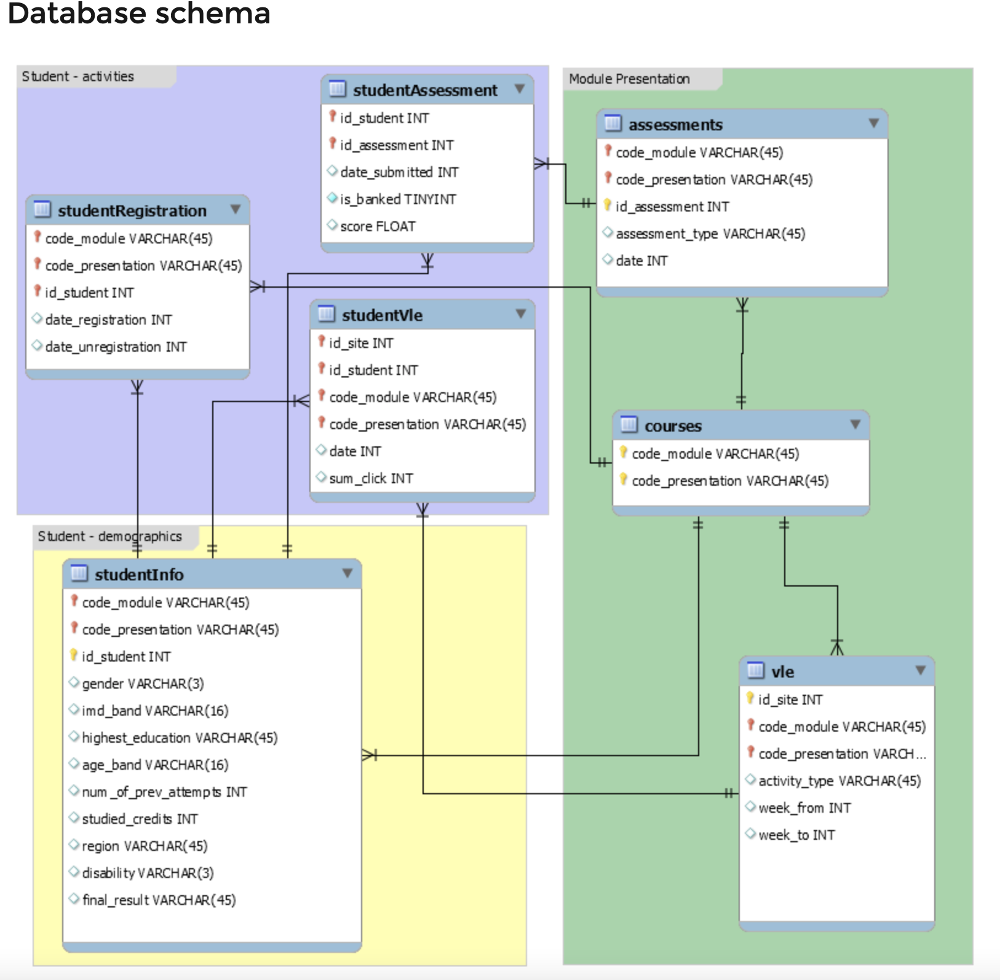

# Data Preparation Overview

The full data cleaning process is stored in [data_cleaning](notebooks/exploratory/data_cleaning.ipynb) notebook in notebooks folder.

Before proceeding to EDA and Modeling the datasets were closely examined and cleaned. I've **removed features** that had missing values or were not relevant to project goals. In addition, for the purpose of modeling, I've selected **observations only by the half term of the course** - 135 days and **dropped observations** that had **"withdrawn" result** within this timeframe. The **scores of assessments** per course were **summed up per student and averaged**. **Number of clicks** were **summed up** per each student on a given course. The **index_row** feature were created to store each student information as unique index for following EDA. 
At the end of the notebook, I've **merged** all relevant and modified features **into one dataframe** that has been stored in data folder as **clean_data.csv** file. 

**Features Selected:**

* **course_length:** length of the code_module in days.
* **code_module:** three letter id of the course.
* **date_registration:** number of days student registered before the course beginning.
* **sum_click:** sum of click student made on Vle for given course.
* **gender:** gender of the student.
* **region:** region of student location in UK.
* **highest_education:** education level of the student.
* **imd_band:** indices of multiple deprivation - a measure of economic status.
* **age_band:** age category of the student.
* **attempts:** number of times the student has attempted the class.
* **disability:** disability status of the student.
* **studied credits:** number of credits student acquired by the begginning of the course.
* **mean_score:** The student's mean assessment score.


**TARGET** - **final_result**
***

# Exploratory Data Analysis

Before proceeding to modeling, multiple statistical analysis and test were performed to identify features that are most significant for project purposes. The **Chi - Square Test** was performed for categorical features to **examine the relation with target.**

### Histogram of Continius Features

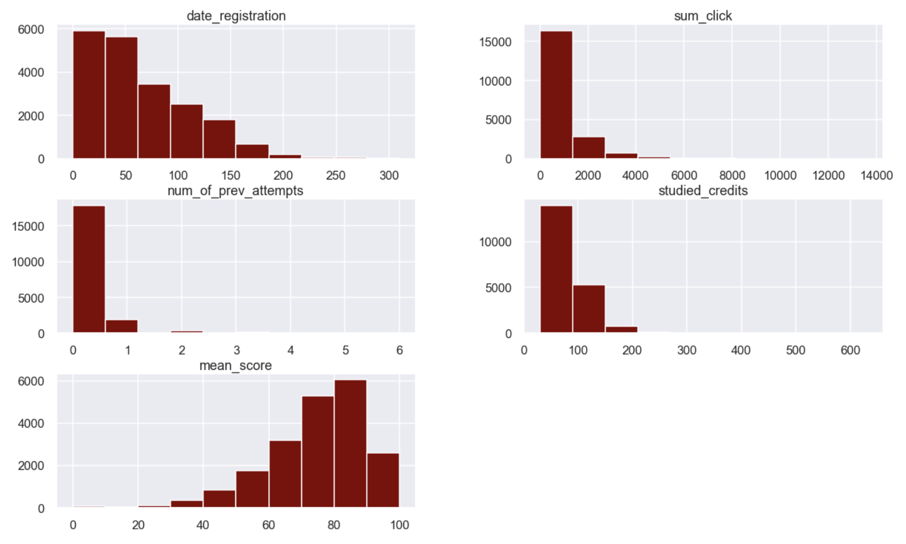

**Results:**

* Majority of the students **register to courses within 50 days** in advance
* Most of the students make within **2000 clicks on online Vle** platform
* Only **few students have more that 1 attempt** 
* Majority have **less than 100 studied credits**

### Distribution of Target Variable


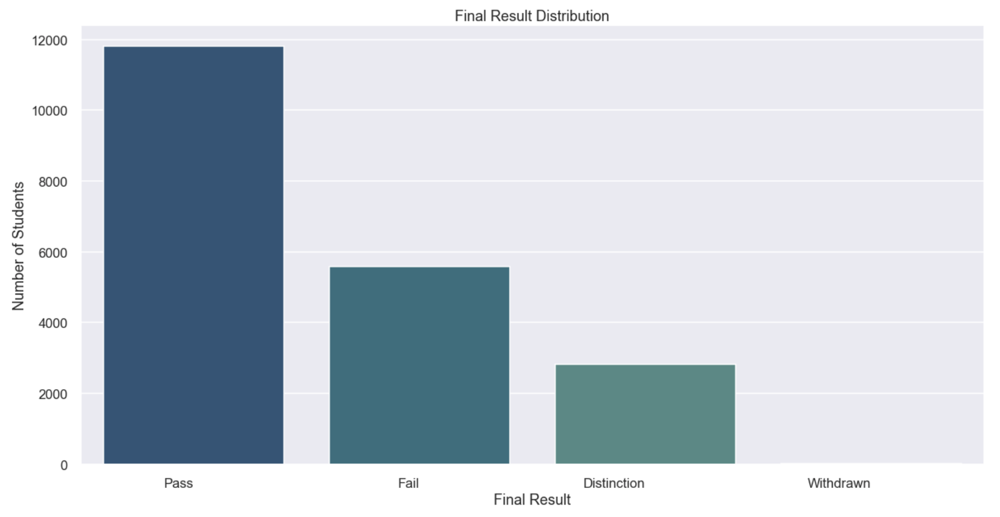

* After data cleaning, the dataset has only **20 observations of withdrawal result**. And majority of observations have passing results.
* **Target is imbalanced**

### Code Module vs. Final Result

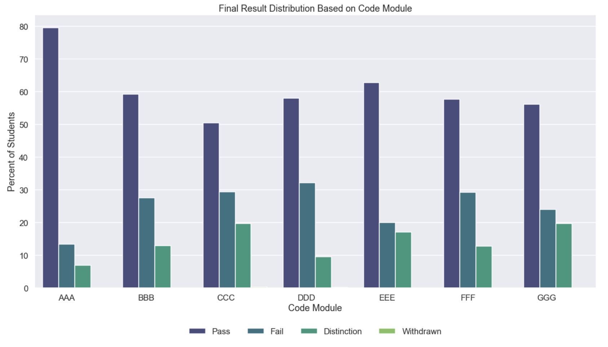

* Based on graph above, the course that has **smallest rate of passing is DDD**, and the course with **highest rate of passing is AAA.** The **CCC and GGG courses** have highest **rate of distinct success**


### Final Result Distribution Based on Gender 

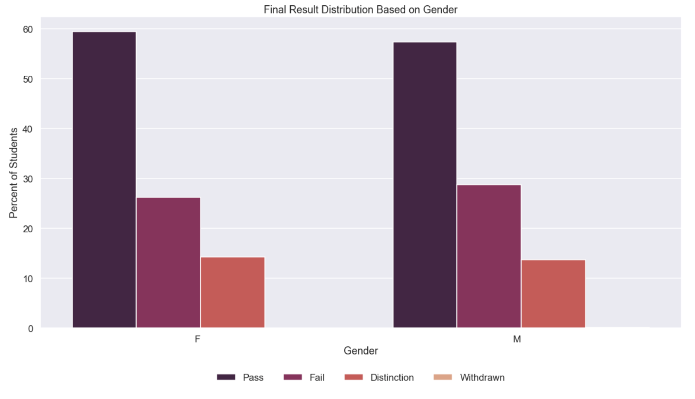

* Based on the graph, **59% of female student pass the course**, while only **57% of male students pass the course.**
* The rate of **failing students is higher for male students.**

### Region and Final Result

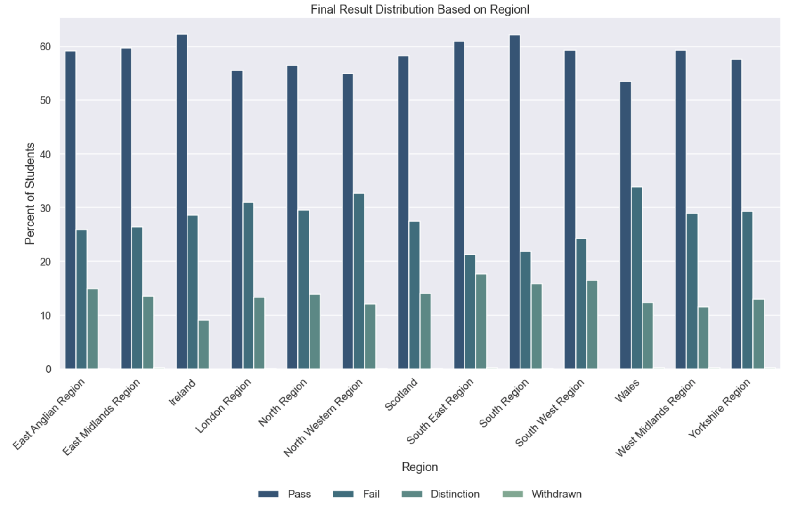

* Smallest rate of passing is observed in **Whales region**, while **South and South East regions** have highest rates. in addition, **South East Region** has highest value of distinc results.
* **East Midlands Region** has highest rate of withdrawing results

### Distribution of Outcomes based on Education Level

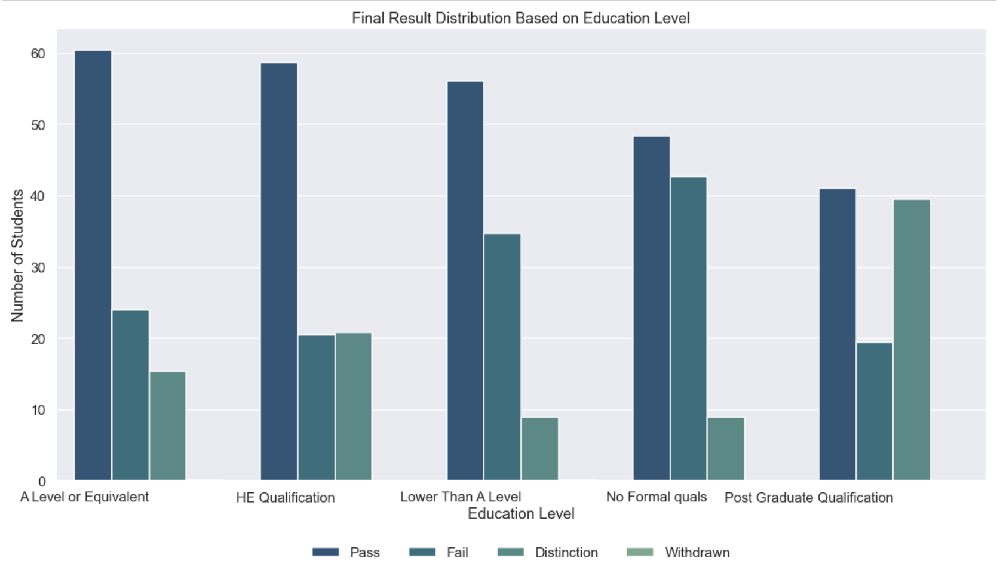

* Students with **no formal qualifications** have lowest rate of passing, while students with **Post Grad level of education** have highest rates.
* Students with **A level of education or lower** tend to withdraw more than students with other levels of education.

### Outcome Distribution by IMD Band

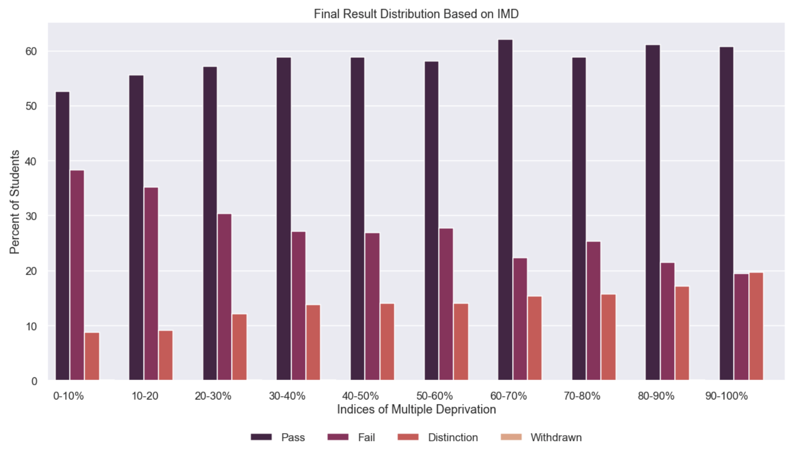

* The higher the imd_band, the higher is the rate of passing result

### Final Result Based on Age Band

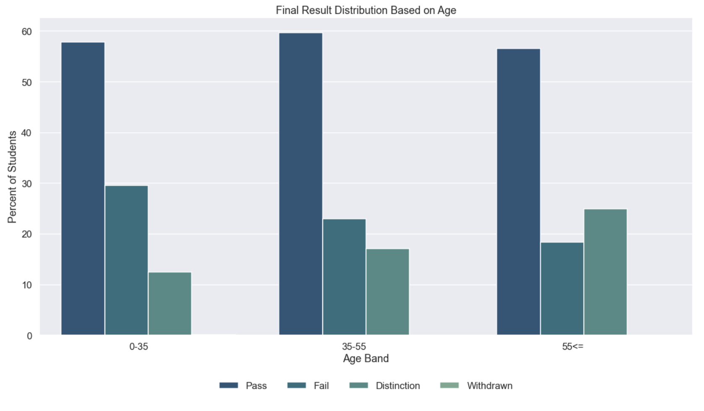

* Based on the graph, students in 55 and up age range have highest rate of disctinct results.
* The higher the age_band, the higher is the rate of success.
* Students in age range of 0-35 tend to withdraw more than students that are older.

### Distribution of Outcomes Based on Disability


* Students with no disability have slightly larger passing rate than students with disability.

***

# Modeling

For binary classification modeling purposes, the target variable was **binarized** as following: **Fail/Withdraw - 1, and Pass/Distinct - 0.**
Since the goal was to identify as much as feasible failing students, the **Recall Scor**e was considered **most significant**, in order to **lower the values of false negative predictions.**

In order to **automate the coding** workflow, the **pipeline with following steps** was used:
- **ColumnTransformer** (transform and encode categorical data)
- **StandardScaler** (scale the data into one magnitude)
- **SMOTE** (upsample the minority class)
- **Classification algorithm**

To **store the evaluation scores for each model,** the user-defined funtion **"model_history"** was used.


## Baseline Model: Logistic Regression

* There were no use of SMOTE algorithm.

### Test Set Recall Score - 0.39, F1 Score - 0.49, Accuracy - 0.77

**Confusion Matrix**

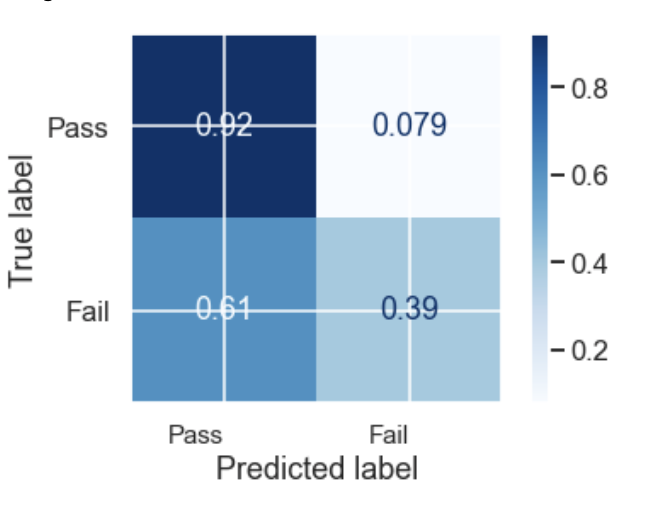

**Evaluation:**

* Model is **overfitting train set.** 
* From confusion matrix it is clear that model predicting **most of the outcomes as "Pass", due to class imbalance**
* About 1/3 of outcomes of test data were **predicted falsely** based on residuals


## Linear Regression with Upsampled Data

### Test Set Recall Score - 0.71, F1 Score - 0.6, Accuracy - 0.74

**Confusion Matrix**

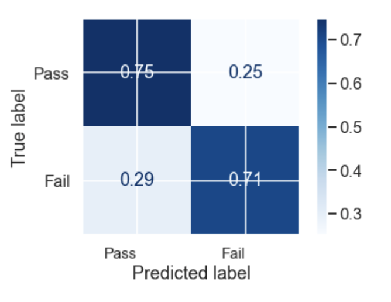

**Evaluation:**

* Upsampled model performed better than imbalanced data in terms of evaluation metrics - **the recall score got higher**
* The confusion matrix shows better performance in term of **high diagonal values.**
* The value of **false negatives went down**

***

### Other Models

**Models**: KNN, Decision Tree, Random Forest, XGBoost, GradientBoost.

**Results**: 

* **KNN** - overfitting train set, low evaluation scores
* **Decision Tree** - high false negative value, low evaluation scores
* **Random Forest** - high false negative value, low evaluation scores
* **XGBoost** - overfitting train set, high false negative value, low evaluation scores
* **Gradient Boost** - overfitting train set, high false negative value, low evaluation scores


***

### GridSearch Best Parameters

The GridSearch was used on following models in order to **tune the hyperparameters** and examine the performance: **Logistic Regression, KNN and Decision Tree.**

Based on the GridSearch Results, the new models were built and evaluated. The results showed **non-significant improvement on KNN and Decision Tree**, but still worse than Logistic Regression.

***

## Logistic Regression with GridSearched Parameters

## Holdout Set: Recall Score - 0.74, F1 Score - 0.6, Accuracy - 0.74

**Confusion Matrix**

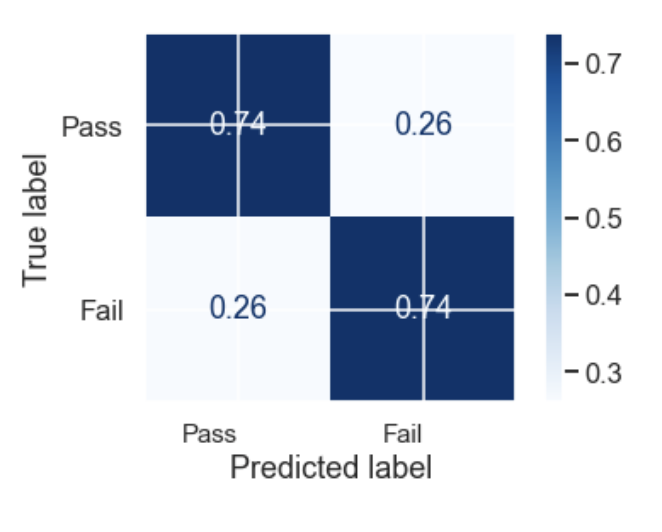
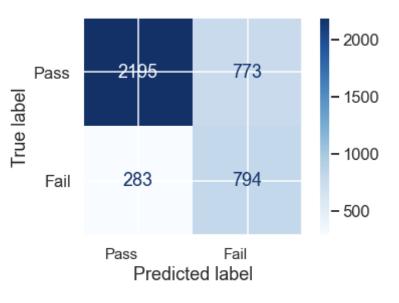

**Evaluation:**

* The results of the model matched the Logistic Regression with upsampled data, except for Recall Score that got higher to 0.74. 

***

### ANOVA Test for Continius Features
ANOVA Test was performed in order to determine the underlying significance of the numeric feature with target.

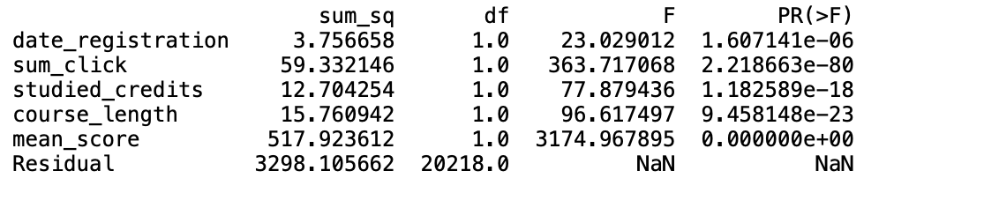

# Conclusion

The Logistic Regression model was able to predict 74% of failing students on holdout data, with falsely predicting only 26% as passing. Based on the EDA, statistical analysis and modeling, following are appropriate steps to take in order to navigate students and increase success rate of institution.

## Recommendations

1. Assist students with Lower than A level of education: provide additional sources for studying and tutoring.
2. Provide excessive support for students who are located in regions with low imd.
3. Advise students in lower age range to closely communicate with students that are older.

4. The critical role in determining the students outcome is played by the score on assessments, thus the additional study sources would be helpfull for students success.
5. The level of interaction of student on online tools has significant impact on the final result, thus advise students to closely interact with online study materials
6. Course length plays small but statistically significant role in outcome, therefore determine optimal course length.


## Future Steps

1. Build a multilabel model to examine the performance compared to binary models
2. Include the Activity type on online sources as a feature.
3. Include time based features related to assessments and student interactions to explore prediction performance.


